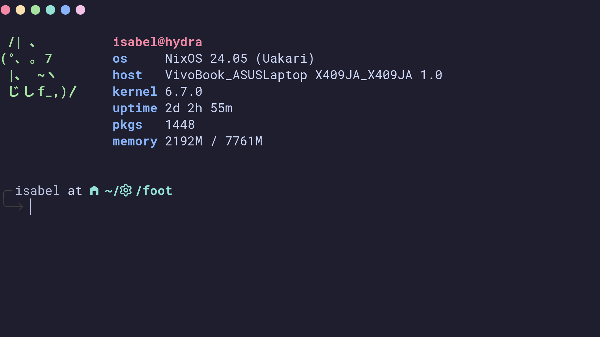

<h3 align="center">
  <br/>
  
  Catppuccin for <a href="https://codeberg.org/dnkl/foot">Foot</a>
  
</h3>

<p align="center">
  <a href="https://github.com/catppuccin/foot/stargazers"></a>
  <a href="https://github.com/catppuccin/foot/issues"></a>
  <a href="https://github.com/catppuccin/foot/contributors"></a>
</p>

<p align="center">
  
</p>

## Previews

<details>
<summary>🌻 Latte</summary>

</details>
<details>
<summary>🪴 Frappé</summary>

</details>
<details>
<summary>🌺 Macchiato</summary>

</details>
<details>
<summary>🌿 Mocha</summary>

</details>

## Usage

1. Copy the theme files next to your `foot.ini` configuration file. (it is usually stored at `~/.config/foot/foot.ini`)

    - Latte
      ```sh
      curl -LO --output-dir ~/.config/foot https://github.com/catppuccin/foot/raw/main/catppuccin-latte.ini
      ```

    - Frappé
      ```sh
      curl -LO --output-dir ~/.config/foot https://github.com/catppuccin/foot/raw/main/catppuccin-frappe.ini
      ```

    - Macchiato
      ```sh
      curl -LO --output-dir ~/.config/foot https://github.com/catppuccin/foot/raw/main/catppuccin-macchiato.ini
      ```

    - Mocha
      ```sh
      curl -LO --output-dir ~/.config/foot https://github.com/catppuccin/foot/raw/main/catppuccin-mocha.ini
      ```

2. Import the desired flavour config in your `foot.ini`

  ```ini
  # uncomment the flavour you want below:

  include=~/.config/foot/catppuccin-mocha.ini
  # include=~/.config/foot/catppuccin-macchiato.ini
  # include=~/.config/foot/catppuccin-frappe.ini
  # include=~/.config/foot/catppuccin-latte.ini
  ```

## 💝 Thanks to

- [Pocco81](https://github.com/Pocco81)
- [crdpa](https://github.com/crdpa)
- [Thibault Andreis](https://github.com/ThibaultAndreis)

&nbsp;

<p align="center"></p>
<p align="center">Copyright &copy; 2021-present <a href="https://github.com/catppuccin" target="_blank">Catppuccin Org</a>
<p align="center"><a href="https://github.com/catppuccin/catppuccin/blob/main/LICENSE"></a></p>
